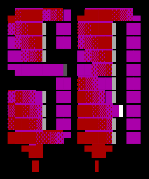

<div align="center">
  
</div>

# Sentinel Audio

**Advanced Hybrid Noise Suppression Pipeline**

Sentinel Audio is an ultra-low latency, hardware-accelerated hybrid noise suppression system engineered for defense and mission-critical communications. Traditional signal processing fails on impulsive noises like gunshots, while modern AI models are often too slow for edge deployments. Sentinel Audio bridges this gap by combining a quantized Deep Neural Network with a classical LMS filter, achieving sub-15ms latency on FPGA fabric.

---

## Architecture Overview

The pipeline utilizes a two-stage hybrid architecture:
1. **Stage 1 (AI Engine):** A Single-Channel Deep Complex Convolutional Recurrent Network (DCCRN) operating on the complex STFT domain erases non-stationary impulsive noise (e.g., artillery, gunshots).
2. **Stage 2 (Classical Filter):** A lightweight Dual-Mic LMS filter cancels stationary noise (e.g., helicopter rotors, engine hum).

The architecture is trained using Quantization-Aware Training (QAT) to INT8 precision and exported via static ONNX memory mapping for deterministic execution on AMD PYNQ or Vitis AI edge boards.

## Key Performance Metrics

- **Signal-to-Noise Ratio (SNR) Improvement:** > 15 dB
- **Short-Time Objective Intelligibility (STOI):** > 0.85
- **Perceptual Evaluation of Speech Quality (PESQ):** > 2.5
- **Inference Latency:** < 15ms (using 512-sample processing chunks)

## Tech Stack

- **Frameworks:** Python, PyTorch (QAT)
- **Audio Processing:** soundfile, librosa
- **Evaluation:** pystoi, pesq
- **Hardware Deployment:** ONNX Runtime, AMD Vitis AI Compiler, VART (Vitis AI Runtime)
- **Target Silicon:** AMD PYNQ / Zynq FPGAs

## Repository Structure

```
.
├── assets/
├── checkpoints/          # Contains fpga_model.onnx and weights
├── dataset/              # LibriSpeech and Military Audio Dataset (MAD)
├── docs/                 # System architecture and deployment documentation
└── src/
    ├── data/             # Dynamic dataset mixing and augmentation
    ├── inference/        # ONNX export, simulation, and PYNQ deployment
    ├── models/           # DCCRN network definition and QAT stubs
    └── training/         # PyTorch training loop and custom MultiLoss
```

## Getting Started

### 1. Model Training (GPU Environment)

The model leverages dynamic PyTorch data pipelines to randomly mix clean speech with military noise at varying SNRs (-5dB to 15dB) on the fly. 

1. Prepare your environment (Google Colab T4 GPU recommended).
2. Ensure the LibriSpeech and MAD datasets are located in the `dataset/` directory.
3. Execute the provided Jupyter notebook `SIH26052_Colab_Training.ipynb`.
4. The QAT-hardened ONNX model will be exported to `checkpoints/fpga_model.onnx`.

### 2. Desktop Edge Simulation

To test the ONNX model and simulate the edge dual-mic hardware environment on a local machine:

```bash
# Clone the repository
git clone https://github.com/fs0cietyx/sentinel-audio.git
cd sentinel-audio

# Install dependencies
pip install -r requirements.txt

# Run the real-time simulation pipeline
python3 src/inference/realtime_pipeline.py --model checkpoints/fpga_model.onnx
```

### 3. Physical FPGA Deployment (PYNQ)

To deploy the pipeline onto physical AMD PYNQ silicon, the ONNX graph must be compiled into an XModel for the Deep Learning Processor Unit (DPU).

1. Compile the ONNX model using the official Vitis AI Docker container:
   ```bash
   ./src/inference/compile_for_pynq.sh
   ```
2. Transfer the resulting `dccrn_anc.xmodel` to your target PYNQ board.
3. Execute the hardware-accelerated VART inference script on the board:
   ```bash
   python3 src/inference/pynq_deployment.py --model checkpoints/dccrn_anc.xmodel
   ```

## Documentation

For a deeper dive into the system design, hardware constraints, and build plans, refer to the `docs/` directory:
- `docs/overview.md` - System Architecture
- `docs/plan-edge-deployment.md` - Edge Target Specifications
- `docs/pitch-deck-outline.md` - High-level presentation outline

## License

This project is licensed under the MIT License. See the `LICENSE` file for details.
